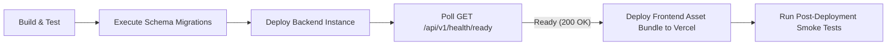

# Production Deployment & Operational Runbook — Chaudhary Kirana Store

## 1. Overview

This runbook outlines the deployment procedure, pre-deployment checklists, post-deployment smoke tests, and rollback strategies for the **Chaudhary Kirana Store** web application.

---

## 2. Pre-Deployment Checklist

Before deploying any build to production:

- [ ] **Environment Configuration**: Validate required environment secrets (`SUPABASE_URL`, `JWT_SECRET`, `OTP_ENCRYPTION_KEY`, `RAZORPAY_KEY_ID`).
- [ ] **Database Migrations**: Ensure new database migrations are idempotent and backward-compatible with existing running instances.
- [ ] **Automated Test Verification**: Run full backend test suite (`npm test` / Node test scripts). All assertions must pass 100%.
- [ ] **Frontend Build Verification**: Execute `npm run build` inside `frontend/`. Must compile with 0 errors.
- [ ] **Backup Readiness**: Confirm database automated backup or PITR restoration point is active.

---

## 3. Deployment Workflow



### Step 1: Database Migration Alignment
Run schema alignment:
```bash
node backend/src/fix_schema_full.js
```

### Step 2: Backend Service Deployment
1. Deploy updated Node.js backend server.
2. The application executes `validateStartupConfig()` on boot:
   - Validates environment variables.
   - Executes AES-256-GCM OTP key format and self-test.
3. Verify readiness endpoint returns HTTP 200:
   ```bash
   curl -s https://<api-domain>/api/v1/health/ready | jq .
   ```

### Step 3: Frontend Deployment (Vercel)
```bash
cd frontend
npm run build
vercel --prod
```

---

## 4. Post-Deployment Smoke Test Suite

Verify key production user journeys:

1. **Public Health Check**:
   - `GET /api/v1/health` -> HTTP 200 `{"status": "ok"}`
2. **System Readiness Check**:
   - `GET /api/v1/health/ready` -> HTTP 200 `{"status": "ok", "operationalState": "ACTIVE"}`
3. **Product Catalog Browsing**:
   - Verify category filters, product detail pages, search page.
4. **Checkout Workflow**:
   - Test Cash on Delivery (COD) order creation.
5. **Real-time Order Status & SSE**:
   - Admin accepts order -> Customer Order Tracking page reflects `PROCESSING` state in real-time.
6. **Delivery OTP & Proof Verification**:
   - Partner verifies 6-digit OTP -> Status updates to `DELIVERED`.

---

## 5. Rollback Procedure

If critical production issues are detected post-deployment:

1. **Stop Rollout / Revert Traffic**:
   - In Vercel Dashboard, promote previous working production deployment to Instant Rollback.
2. **Backend Application Rollback**:
   - Revert backend container/instance to previous Git release commit.
3. **Database Schema Considerations**:
   - **Expand/Contract Principle**: Database migrations must NOT be destructively rolled back while previous code versions may rely on added columns or tables (`background_jobs`).
   - Leave non-breaking columns intact during rollback.
4. **Verify Health Post-Rollback**:
   - Confirm `GET /api/v1/health/ready` returns HTTP 200 OK.
