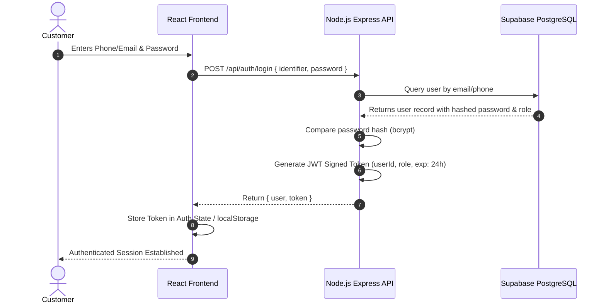
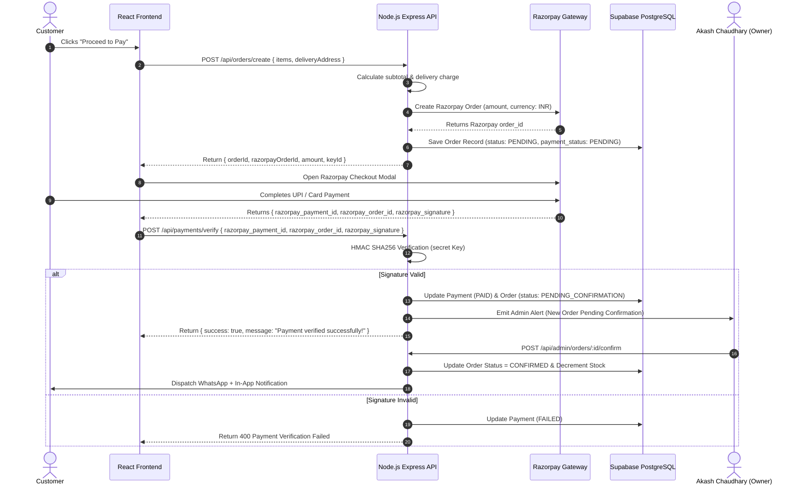

# Architecture Document — Chaudhary Kirana Store

## 1. High-Level Architecture Overview

**Chaudhary Kirana Store** is built as a modern, decoupled full-stack web application designed for fast mobile shopping and real-time store management.

### Component Overview
* **Frontend:** React (Vite) single-page application hosted on **Vercel**. Uses modern state management, CSS custom properties design tokens, Lucide icons, and responsive layouts.
* **Backend API:** Node.js + Express RESTful API web service hosted on **Render**. Manages business logic, JWT authentication, delivery charge calculations, Razorpay HMAC signature validation, order transitions, and notification payloads.
* **Database & Auth:** **Supabase PostgreSQL** instance storing relational schemas, inventory counters, JSON logs, and user credentials.
* **Payment Gateway:** **Razorpay Payment Gateway** supporting UPI (PhonePe, GooglePay, Paytm), Cards, NetBanking with backend verification.
* **Notifications:** Internal notification dispatch pipeline generating customer WhatsApp message links/payloads and real-time in-app alerts.
* **AI Service:** Store Context AI Assistant service providing real-time product search and store policy guidance.

---

## 2. Architecture Diagram (Mermaid)

```mermaid
graph TB
    subgraph Client Layer
        MobileBrowser[Mobile Web Browser]
        DesktopBrowser[Desktop Web Browser]
    end

    subgraph CDN & Frontend Hosting
        Vercel[Vercel CDN Edge Network]
        ReactApp[React Single Page Application]
    end

    subgraph Backend Micro-Services - Render
        ExpressAPI[Node.js / Express REST API]
        AuthMiddleware[JWT Auth & RBAC Middleware]
        DeliveryEngine[Delivery Distance Calculator Engine]
        PaymentService[Razorpay Payment Verification Service]
        NotificationEngine[WhatsApp & In-App Notification Dispatcher]
        AIChatService[AI Kirana Assistant Service]
    end

    subgraph External Cloud Services
        Supabase[(Supabase PostgreSQL Database)]
        Razorpay[Razorpay Payment Gateway Engine]
        WhatsApp[WhatsApp API / Message Payload Dispatch]
    end

    Client Layer --> Vercel
    Vercel --> ReactApp
    ReactApp -- HTTPS / REST API --> ExpressAPI
    ExpressAPI --> AuthMiddleware
    ExpressAPI --> DeliveryEngine
    ExpressAPI --> PaymentService
    ExpressAPI --> NotificationEngine
    ExpressAPI --> AIChatService
    ExpressAPI -- Connection Pool --> Supabase
    PaymentService -- HMAC Signature Verification --> Razorpay
    NotificationEngine -- Message Payload --> WhatsApp
```

---

## 3. Frontend Architecture

### Structure (`frontend/src/`)
```text
frontend/
├── src/
│   ├── api/             # Axios API client instances with interceptors
│   ├── assets/          # Static images, store logos, fallback banners
│   ├── components/      # Reusable UI components (Navbar, ProductCard, CartDrawer, etc.)
│   ├── context/         # React Contexts (AuthContext, CartContext, NotificationContext)
│   ├── hooks/           # Custom React hooks (useCart, useAuth, useDebounce, useProducts)
│   ├── layouts/         # MainLayout, AdminLayout, AuthLayout
│   ├── pages/           # Public, Customer, and Admin view components
│   ├── routes/          # ProtectedRoute, AdminRoute, AppRoutes setup
│   ├── services/        # Local storage sync, formatting utilities, distance calculator
│   ├── styles/          # index.css (Design System Tokens, Tailwind-free Vanilla CSS)
│   └── App.jsx          # Top-level Router & Provider wrapper
```

### State Management Strategy
1. **Auth Context:** Holds JWT access token, decoded user role (`CUSTOMER` vs `ADMIN`), and current user profile details.
2. **Cart Context:** Persists cart items locally in `localStorage` for guests and synchronizes with Supabase database upon user login.
3. **Notification Context:** Manages active toast notifications, alert badges, and unread notification counts.

---

## 4. Backend Architecture

### Structure (`backend/src/`)
```text
backend/
├── src/
│   ├── config/          # Database, Razorpay, JWT, and Cors configurations
│   ├── controllers/     # Controller handlers (Auth, Products, Cart, Orders, Admin, AI)
│   ├── middleware/      # AuthGuard, AdminGuard, ErrorHandler, RateLimiter, Validator
│   ├── models/          # Supabase SQL query helper modules & data mappers
│   ├── routes/          # Express Router modules (/api/auth, /api/products, /api/orders...)
│   ├── services/        # Razorpay signature service, WhatsApp payload builder, Delivery calc
│   ├── utils/           # Logger, Custom API Error responses, Distance formula helpers
│   └── server.js        # Express application entry point & listener
```

### Layered Processing Pattern
```text
HTTP Request ──► Express Router ──► Auth/Admin Guard Middleware ──► Controller Handler ──► Service Layer ──► Supabase DB ──► JSON Response
```

---

## 5. Database Architecture

* **Engine:** PostgreSQL hosted on Supabase.
* **Connection Management:** Connection pooling via Supabase connection strings using standard SQL parameters.
* **Integrity Constraints:** Primary key UUIDs, foreign key cascades/restricts, unique indexes on user emails/phones, check constraints on stock and prices.

---

## 6. Authentication Architecture & Flow



---

## 7. Order & Razorpay Payment Architecture Flow



---

## 8. Delivery Charge Calculation Engine Architecture

The delivery service calculates the exact distance between the fixed store coordinates and the customer's selected delivery address.

```text
Store Coordinates (Mahruni): Latitude 24.2381° N, Longitude 78.7364° E
```

### Calculation Rule Architecture
```javascript
function calculateDeliveryCharge(distanceKm, freeRadiusKm = 1, extraKmRate = 10) {
  if (distanceKm <= freeRadiusKm) {
    return 0;
  }
  const extraDistance = Math.ceil(distanceKm - freeRadiusKm);
  return extraDistance * extraKmRate;
}
```

---

## 9. Notification & WhatsApp Payload Architecture

The Notification Dispatcher abstracts multi-channel delivery:

```mermaid
graph LR
    Trigger[Order Event Trigger] --> Dispatcher[Notification Service Dispatcher]
    Dispatcher --> InApp[In-App Notification DB Table]
    Dispatcher --> WA[WhatsApp Link & Cloud API Payload Generator]
    InApp --> NotificationBadge[Customer/Admin UI Notification Center]
    WA --> WACustomer[WhatsApp Message to Customer]
    WA --> WAAdmin[WhatsApp Alert to Akash Chaudhary (+91 7897837095)]
```

---

## 10. AI Chatbot Architecture

The AI Chatbot uses a localized RAG-lite vector search pipeline:
1. Customer inputs text query (e.g., "Do you have Fortune Mustard Oil 1L?").
2. Controller searches Supabase database using fuzzy SQL pattern matching on active products.
3. Chatbot formats contextual answer with product price, stock status, direct "Add to Cart" link, and store delivery rules.

---

## 11. Deployment Architecture

```mermaid
graph TD
    subgraph Git Source Control
        GitHubRepo[GitHub Repository: chaudhary-kirana-store]
    end

    subgraph CI/CD Vercel
        VercelBuild[Vercel Automated Build] --> FrontendCDN[Global Edge CDN (Frontend SPA)]
    end

    subgraph CI/CD Render
        RenderBuild[Render Automated Container Build] --> ExpressServer[Express Web Service]
    end

    subgraph Cloud Database
        SupabaseCloud[(Supabase Managed PostgreSQL & Auth)]
    end

    GitHubRepo -- Push main branch --> VercelBuild
    GitHubRepo -- Push main branch --> RenderBuild
    ExpressServer <--> SupabaseCloud
```
