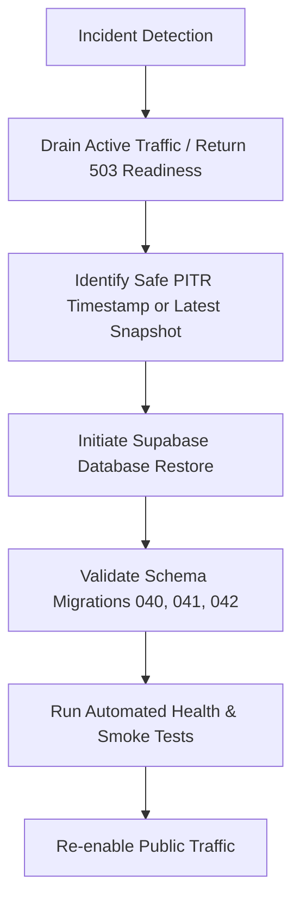

# Database Backup, Disaster Recovery & Restoration Procedures — Chaudhary Kirana Store

## 1. Executive Overview

This document specifies the disaster recovery (DR), Point-In-Time Recovery (PITR), and emergency data restoration procedures for the **Chaudhary Kirana Store** PostgreSQL database hosted on Google Cloud / Supabase infrastructure.

---

## 2. Backup Strategy & Retention Expectations

### Managed Backups
- **Daily Automated Backups**: Managed automatically by Supabase infrastructure at `02:00 UTC` daily.
- **Retention Period**:
  - **Free Tier / Standard Plan**: 7-day daily snapshot retention.
  - **Production Enterprise / Pro Plan**: 30-day snapshot retention with Point-In-Time Recovery (PITR).
- **Point-In-Time Recovery (PITR)**:
  - Granularity: Physical write-ahead log (WAL) archiving allowing restoration to any specific second within the retention window.
  - Supported: Requires Supabase Pro/Enterprise tier enabled.

### Application Data Considerations
Critical production tables subject to zero-data-loss requirements:
- `orders`, `order_items`, `order_addresses`, `order_status_history`
- `payments`, `refunds`
- `delivery_assignments`
- `coupons`, `cancellation_requests`, `returns`, `replacement_requests`
- `background_jobs`

---

## 3. Emergency Recovery Procedure



### Step 1: Incident Detection & Traffic Protection
1. If database corruption, data loss, or unsafe schema execution occurs, immediately set server operational state to `DRAINING`:
   ```bash
   # Readiness endpoint returns HTTP 503 unavailable
   node backend/src/services/gracefulShutdown.service.js --drain
   ```

### Step 2: Identify Restoration Timestamp
1. Check application logs or `admin_activity_logs` to determine the exact timestamp preceding the incident.
2. Example timestamp: `2026-08-25T19:30:00Z`.

### Step 3: Execute Restoration
1. Access Supabase Dashboard -> **Project Settings** -> **Database** -> **Backups**.
2. Select **Point in Time Recovery (PITR)**.
3. Input target timestamp (`2026-08-25T19:30:00Z`).
4. Trigger restore to a new database instance or overwrite existing target database.

### Step 4: Validate Schema Alignment
Run full schema alignment verification:
```bash
node backend/src/fix_schema_full.js
```
Verify required migrations are present:
- `040_encrypted_delivery_otp.sql`
- `041_performance_indexes.sql`
- `042_background_jobs.sql`

---

## 4. Post-Recovery Data Integrity Checks

Execute the following database queries to confirm consistency:

```sql
-- 1. Check total order count and recent order status integrity
SELECT status, COUNT(*) FROM orders GROUP BY status;

-- 2. Verify non-negative inventory levels
SELECT id, name, stock FROM products WHERE stock < 0;

-- 3. Verify active delivery assignment consistency
SELECT status, COUNT(*) FROM delivery_assignments GROUP BY status;

-- 4. Verify background jobs queue state
SELECT status, COUNT(*) FROM background_jobs GROUP BY status;
```

---

## 5. Resuming Traffic & Verification

1. Run backend health readiness check:
   ```bash
   curl -i http://localhost:5000/api/v1/health/ready
   ```
2. Verify output returns:
   ```json
   {
     "status": "ok",
     "operationalState": "ACTIVE",
     "database": { "status": "connected_supabase_postgresql" }
   }
   ```
3. Resume public routing.
