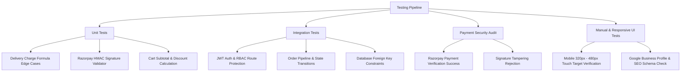

# Testing & Quality Assurance Plan — Chaudhary Kirana Store

## 1. Testing Strategy Overview

The testing framework guarantees high performance, robust payment security, exact delivery fee calculation, and flawless mobile responsiveness for **Chaudhary Kirana Store**.

---

## 2. Test Execution Matrix



---

## 3. Unit Test Cases

### 3.1 Delivery Charge Calculation Unit Tests

| Case ID | Distance Input ($d$) | Free Radius | Extra Fee / KM | Expected Output | Status |
| :--- | :--- | :--- | :--- | :--- | :--- |
| `TC-DEL-01` | 0.5 KM | 1.0 KM | ₹10 | ₹0 (Free Delivery) | Pass |
| `TC-DEL-02` | 1.0 KM | 1.0 KM | ₹10 | ₹0 (Free Delivery) | Pass |
| `TC-DEL-03` | 1.2 KM | 1.0 KM | ₹10 | ₹10 ($\lceil 0.2 \rceil \times 10$) | Pass |
| `TC-DEL-04` | 2.0 KM | 1.0 KM | ₹10 | ₹10 ($\lceil 1.0 \rceil \times 10$) | Pass |
| `TC-DEL-05` | 2.5 KM | 1.0 KM | ₹10 | ₹20 ($\lceil 1.5 \rceil \times 10$) | Pass |
| `TC-DEL-06` | 5.0 KM | 1.0 KM | ₹10 | ₹40 ($\lceil 4.0 \rceil \times 10$) | Pass |

---

### 3.2 Razorpay Signature HMAC Verification Unit Test

```javascript
// Test logic signature verification
describe('Razorpay Signature Verification', () => {
  it('should return true for valid HMAC SHA256 signature', () => {
    const razorpayOrderId = 'order_Kx8192aMzkL';
    const razorpayPaymentId = 'pay_Lz9102bNzkP';
    const secret = 'test_secret_key_123';
    
    const expectedSignature = crypto
      .createHmac('sha256', secret)
      .update(razorpayOrderId + '|' + razorpayPaymentId)
      .digest('hex');

    const isValid = verifyRazorpaySignature(razorpayOrderId, razorpayPaymentId, expectedSignature, secret);
    expect(isValid).toBe(true);
  });

  it('should reject tampered payment signature', () => {
    const isValid = verifyRazorpaySignature('order_123', 'pay_456', 'invalid_sig', 'secret');
    expect(isValid).toBe(false);
  });
});
```

---

## 4. Security & Vulnerability Audits

1. **SQL Injection:** Enforce parameterized queries via `@supabase/supabase-js` client; verify raw user input is never concatenated into SQL strings.
2. **XSS Protection:** Sanitize text inputs using `DOMPurify` / React JSX automatic HTML entity encoding.
3. **Rate Limiting:** Express API rate limiting set to maximum 100 requests per 15 minutes per IP address for public routes.

---

## 5. Responsive UI & SEO Checklist

* **Mobile Viewport Test:** Tested on iPhone SE (375px), Samsung Galaxy S20 (360px), iPad Air (820px).
* **SEO Validation:** Verified JSON-LD LocalBusiness schema format and Open Graph title tags (`og:title`, `og:image`).
