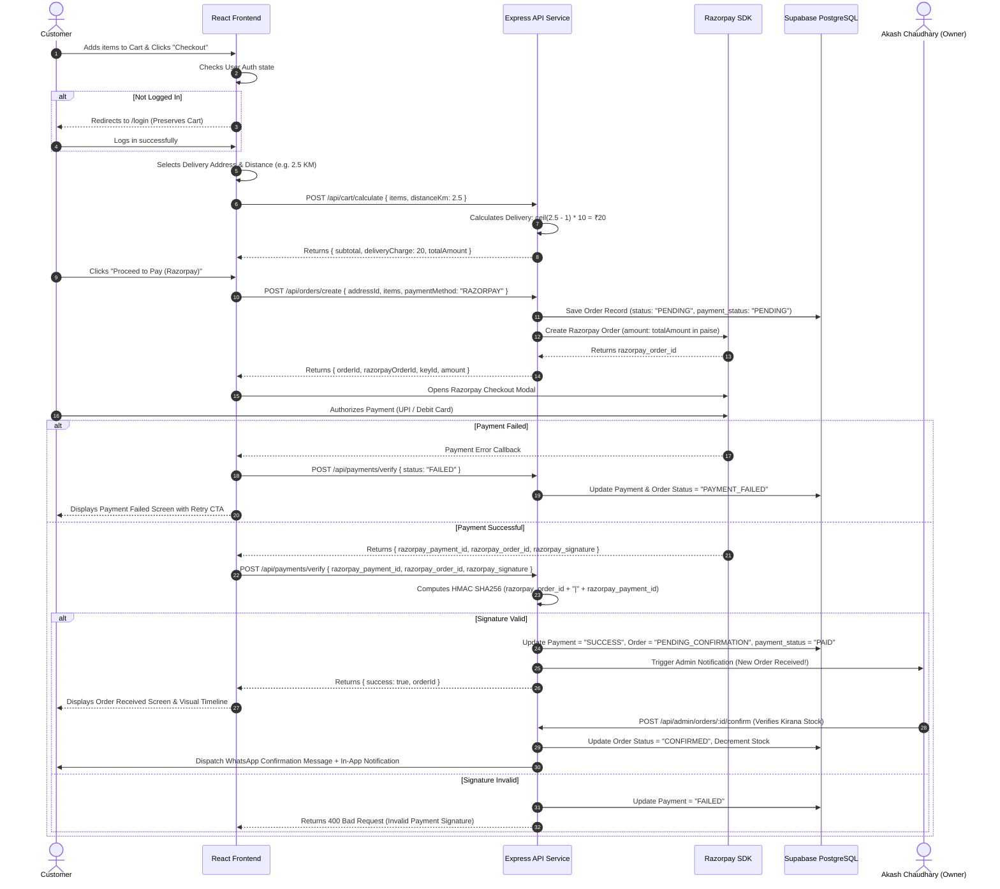

# End-to-End User Flows & Sequence Diagrams — Chaudhary Kirana Store

## 1. Overview of Core User Flows

This document details the step-by-step logic, decision branches, error fallbacks, and visual sequence diagrams for the primary customer and store owner operational flows.

---

## 2. Customer Order Placement & Payment Flow



---

## 3. Detailed Step-by-Step Logic Specifications

### Flow A: Dynamic Delivery Charge Calculation
1. **User Selects Address:** Customer picks address from saved list or enters new address in Mahruni.
2. **Distance Lookup:** Distance is retrieved (e.g. $d = 2.5\text{ km}$).
3. **Formula Execution:**
   - If $d \le 1.0\text{ km} \implies \text{deliveryCharge} = ₹0$.
   - If $d > 1.0\text{ km} \implies \text{deliveryCharge} = \lceil d - 1.0 \rceil \times 10$.
   - For $2.5\text{ km} \implies \lceil 1.5 \rceil \times 10 = 2 \times 10 = ₹20$.
4. **Validation Check:** If $d > 15.0\text{ km}$ (Maximum Serviceable Radius), system displays warning: *"Delivery address is beyond our 15 KM service zone from Near Bada Jain Mandir."*

---

### Flow B: Admin Product & Stock Inventory Management
1. **Admin Navigates to `/admin/products/new`.**
2. **Fills Form:** Title (`Fortune Mustard Oil 1L`), Category (`Oil & Ghee`), MRP (`₹175`), Selling Price (`₹150`), Unit (`litre`, `1.0`), Stock (`40`), Low Stock Alert (`5`).
3. **Submits Form:** API validates `sellingPrice <= mrpPrice` and `stockQuantity >= 0`.
4. **Database Record:** Insert into `products` table and `inventory` table.
5. **Real-time Alert:** If stock quantity drops below threshold during order fulfillment, admin sees low-stock alert pill in dashboard header.

---

### Flow C: WhatsApp Message Payload Dispatch
Upon Admin confirming order availability (`POST /api/admin/orders/:id/confirm`), backend generates the formatted message text:

```text
🎉 Your order from Chaudhary Kirana Store has been confirmed!

Order ID: #CKS-9921
Total Amount: ₹490
Status: Confirmed

Items:
- Aashirvaad Atta 5kg (x2)
- Fortune Mustard Oil 1L (x1)

Thank you for shopping with us! 🛒
Store Contact: 7897837095 / 7007550184
Near Bada Jain Mandir, Mahruni
```

The system triggers both an in-app notification record and an open-in-WhatsApp link (`https://wa.me/919876543210?text=...`) for one-click customer communication.
